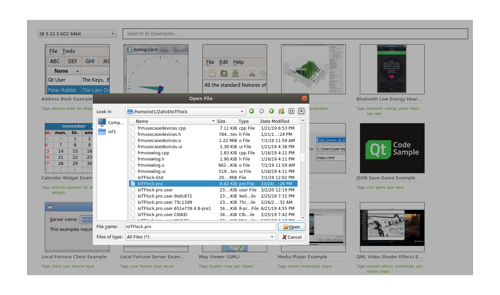
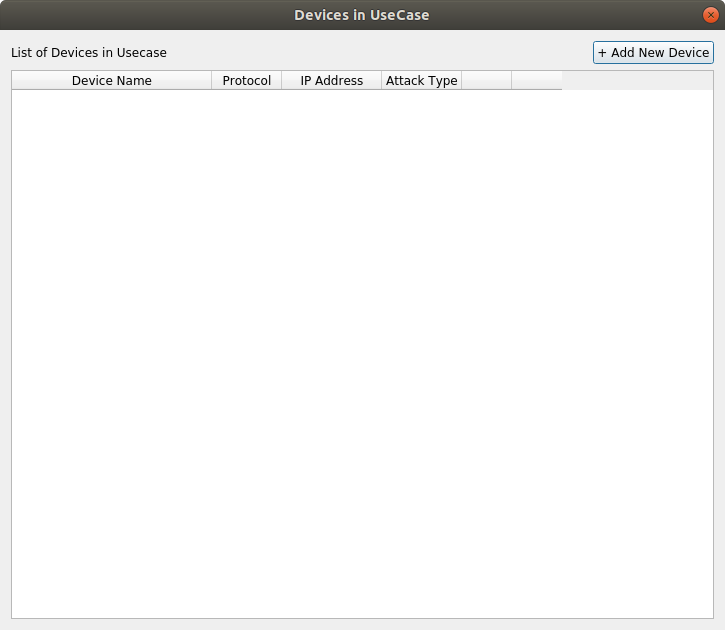
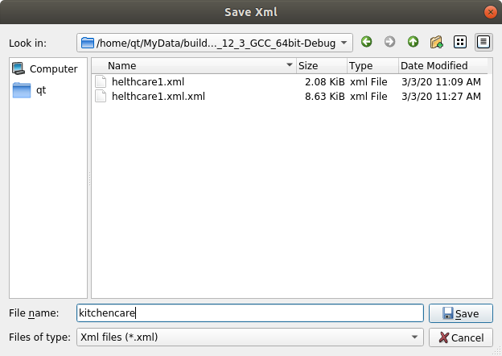
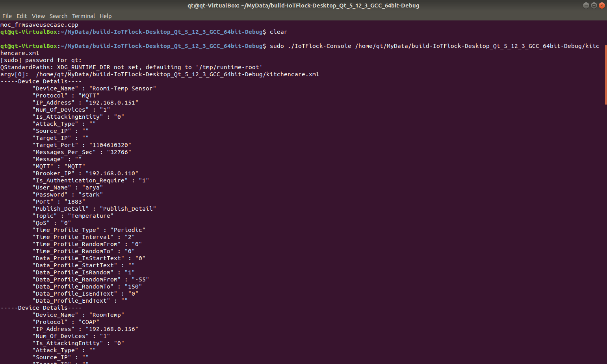

# IoT-Flock #
IoT-Flock is an open-source tool for IoT traffic generation which supports the two widely used IoT
application layer protocols, i.e., MQTT and CoAP. IoT-Flock allows a user to create an IoT use case,
add customized IoT devices into it and generate normal and malicious IoT traffic over a real-time
network.
# Sponsors #

# Uses #
* IoT-Flock allows a user to generate the detailed custom packets.
* IoT-Flock can also be used in stress testing of different IoT-based network utilities like switches, routers, etc., by generating a large amount of IoT device traffic.
* It can be used for the designing and testing of IoT security providing entities like IDS, IPS, etc.
* IoT-Flock can help the researchers in IoT Security Research. The researchers can easily build their own use case, model IoT devices into it and then generate & analyse the traffic of the use case in order to develop better security solutions for IoT.
* The Network Engineers can use IoT-Flock for benchmarking the network features and to troubleshoot the network problems.

# IoT Attacks included in IoT-Flock #
Currently, we included four recent IoT application layer vulnerability attacks in the IoT-Flock: 
* MQTT Packet Crafting Attack (CVE-2016-10523)
* MQTT Publish Flood (CVE-2018-1684)
* CoAP Segmentation Fault Attack (CVE-2019-12101) 
* CoAP Memory Leak Attack (CVE-2019-9004)

# How to Install & Use #
## 1) Install Dependencies ##
Install the following dependies in order to run IoT-Flock:
#### QT Creater ####
Link: https://www.qt.io/download  
File Name used in project is: qt-opensource-linux-x64-5.12.3_2.run
#### Libtins ####
  sudo apt-get update -y 
  sudo apt-get install -y libtins-dev
#### libcap ####
  sudo apt-get install libpcap-dev libssl-dev cmake
#### Boost ####
  sudo apt-get install libboost-all-dev
#### OpenGL ####
  sudo apt-get install mesa-utils
#### FreeGlut ####
  sudo apt-get install freeglut3-dev
#### QTCompiler ####
  sudo apt-get install qt5-default
#### Wireshark ####
sudo add-apt-repository ppa:wireshark-dev/stable 
sudo apt-get update 
sudo apt-get install wireshark 
sudo wireshark 

#### MQTT - Protocol ####
##### Mosquitto Broker #####
sudo apt-get update 
sudo apt-get install mosquitto
##### Mosquitto Client #####
sudo apt-get install mosquitto-clients

#### CoAP - Protocol ####
##### CoAPthon (implementation of CoAP Protocol in Python) #####
First install the Python 
sudo apt install python 
sudo apt install python-pip 
pip install CoAPthon 
 Link for Code: https://github.com/Tanganelli/CoAPthon 

## 2) Download the Source Code ##
Source Code is download from : https://github.com/ThingzDefense/IoT-Flock
## 3) Build the Source Code ##
import the 'IoTFlock' Project file into the QTCreator 5 as
 
after successfully import the project file as below
 
click on the build-all from the build tab to successfuly build the code to the target system as 
 
after that click on Run Button to run the program as 
 
## 4) Add the Use Case ##
 
after add new use case click on edit to add devices as
## 5) Add IoT Devices ##
 
then fill the fields of device attributes as 
 
 
then device successfully added 
 
then save the device cong as XML as 
 
 
## 5) Run the Use Case and Generate Use Case Traffic ##
### Command to Run the xml File and gernerate the Traffic ###
#### From Source builds ####
Note:in case of build from source code the directory "build-IoTFlock1-Desktop_Qt_5_12_3_GCC_64bit-Debug" contains the binaries of the code so you have to open the directory and open in terminal write the command to run the project.
#### From already builded bineries #####
open the directory named "IoT-Flock-Binaries" in the terminal and write the command to run the xml file 
##### sudo ./IoTFlock-Console ./path of xml file/kitchencare.xml #####

Then the results is

----
## Publication ##
https://www.kics.edu.pk/labs/about/iril 
### License ### 
GNU General Public License. Contact us [IRIL Team](mailto:ghazanfar.abbas@kics.edu.pk) if you require a different license. 
### Copyright (c) 2019 ###
IoT-Flock is developed by IoT Research and Inovation Lab, 
Al-Khawarizmi Institute of Computer Science (KICS), UET, Lahore, Pakistan.(92)
